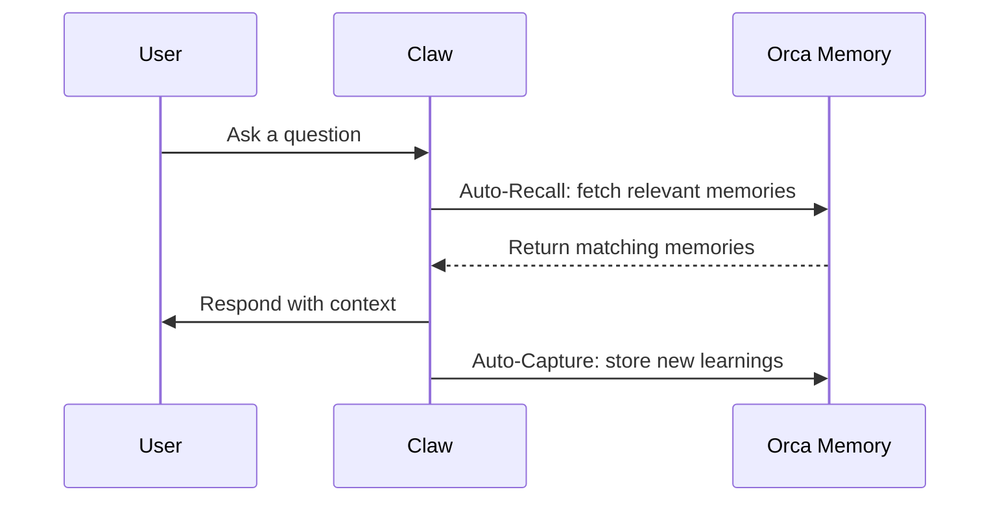

## Overview

Orca Memory is an [OpenClaw plugin](https://docs.openclaw.ai/plugin#plugins) that provides persistent memory for your Claw. It stores and retrieves memories automatically to maintain context across sessions.

## Projects

A **project** is your workspace in Orca Memory. Each project has:

- A unique API key for authentication
- Its own set of memories
- Configurable memory types
- Usage analytics

You can create multiple projects for different codebases or use cases.

## Agents

An **agent** represents your Claw connected to a project. When you install the Orca Memory plugin, your Claw becomes capable of:

- Storing new memories via the API
- Retrieving relevant memories before responding
- Updating existing memories as context changes

## Plugin Features

### Auto-Recall

When enabled, relevant memories are automatically injected into the conversation before each AI turn. The plugin:

1. Takes the current conversation context
2. Searches for semantically similar memories
3. Injects them as system context

Configure with `maxRecallResults` (default: 10) and `profileFrequency`.

### Auto-Capture

When enabled, important information is automatically extracted and stored after each turn. The plugin analyzes the conversation and stores:

- User preferences mentioned
- Decisions made
- Facts learned
- Patterns observed

Configure with `captureMode`: `all` (default, filters noise) or `everything`.

### Tools

Your Claw also has manual control via tools:

| Tool | Description |
|------|-------------|
| `orca_memory_store` | Store a new memory |
| `orca_memory_search` | Search existing memories |
| `orca_memory_forget` | Delete a memory |
| `orca_memory_profile` | View memory profile |

## Memory Types

Orca Memory uses four distinct memory types, inspired by human cognition:

### Episodic Memory

Stores specific events and conversations. Useful for:
- Recalling past debugging sessions
- Remembering previous discussions about architecture
- Tracking decision history

### Semantic Memory

Stores facts and knowledge about your project. Useful for:
- Project structure and conventions
- Technology stack information
- Business logic rules

### Procedural Memory

Stores patterns, preferences, and how-to knowledge. Useful for:
- Coding style preferences
- Workflow patterns
- Repeated procedures

### Working Memory

Stores active, short-term context. Useful for:
- Current task details
- Recent decisions in the session
- Temporary context

Working memory is typically cleared or updated more frequently than other types.

## How It Works

1. **User interacts** with their Claw
2. **Auto-Recall** fetches relevant memories from Orca Memory
3. **Claw responds** using retrieved context
4. **Auto-Capture** stores new learnings as memories
