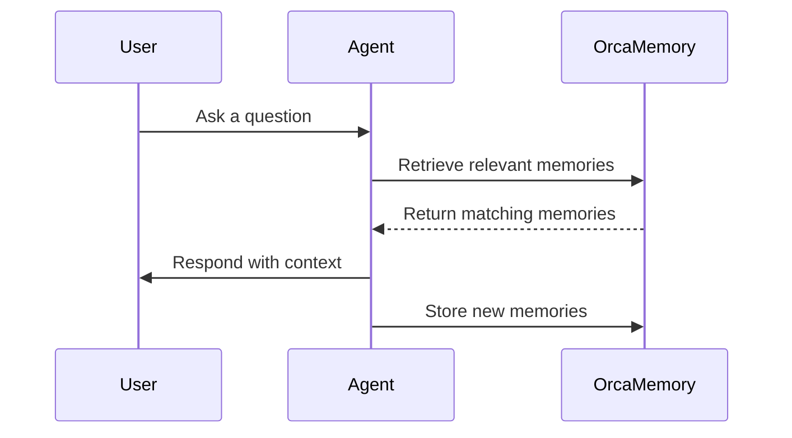

## Overview

OrcaMemory provides AI agents with persistent memory through a simple API. Agents store and retrieve memories to maintain context across sessions.

## Projects

A **project** is your workspace in OrcaMemory. Each project has:

- A unique API key for authentication
- Its own set of memories
- Configurable memory types
- Usage analytics

You can create multiple projects for different codebases or use cases.

## Agents

An **agent** is any AI assistant that connects to your project. When you add the OrcaMemory prompt to your agent's rules file, it becomes capable of:

- Storing new memories via the API
- Retrieving relevant memories before responding
- Updating existing memories as context changes

## Memory Types

OrcaMemory uses four distinct memory types, inspired by human cognition:

### Episodic Memory

Stores specific events and conversations. Useful for:
- Recalling past debugging sessions
- Remembering previous discussions about architecture
- Tracking decision history

```json
{
  "type": "episodic",
  "content": "Debugged authentication issue - root cause was expired JWT tokens",
  "tags": ["auth", "debugging", "jwt"]
}
```

### Semantic Memory

Stores facts and knowledge about your project. Useful for:
- Project structure and conventions
- Technology stack information
- Business logic rules

```json
{
  "type": "semantic",
  "content": "This project uses Convex for the backend with Better Auth for authentication",
  "tags": ["stack", "backend"]
}
```

### Procedural Memory

Stores patterns, preferences, and how-to knowledge. Useful for:
- Coding style preferences
- Workflow patterns
- Repeated procedures

```json
{
  "type": "procedural",
  "content": "User prefers TypeScript strict mode and explicit return types on all functions",
  "tags": ["preferences", "typescript"]
}
```

### Working Memory

Stores active, short-term context. Useful for:
- Current task details
- Recent decisions in the session
- Temporary context

Working memory is typically cleared or updated more frequently than other types.

## Sessions

A **session** represents a conversation between you and an agent. When session logging is enabled:

- Each conversation is automatically recorded
- Sessions are searchable for future reference
- You can review past interactions in the dashboard

## How It Works



1. **User interacts** with their AI agent
2. **Agent retrieves** relevant memories from OrcaMemory
3. **Agent responds** using retrieved context
4. **Agent stores** new learnings as memories
